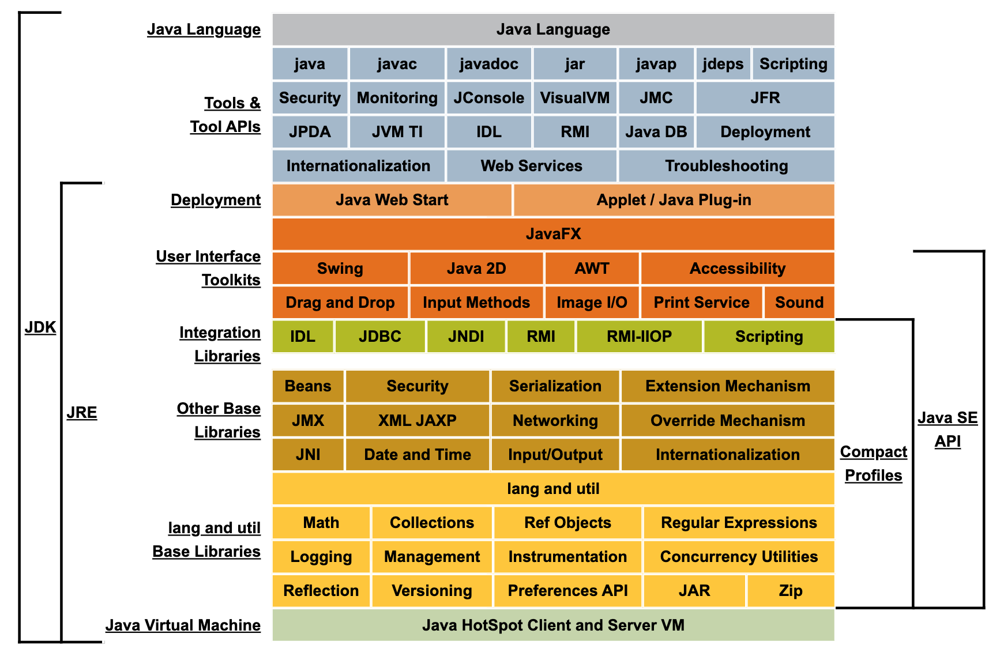
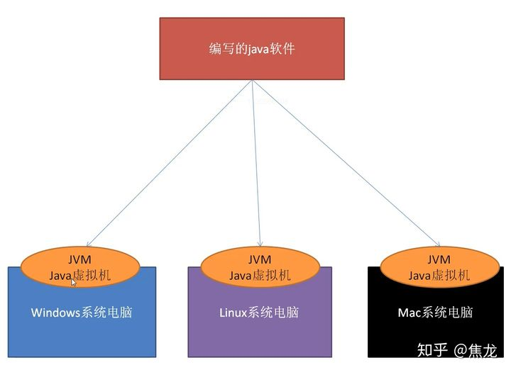
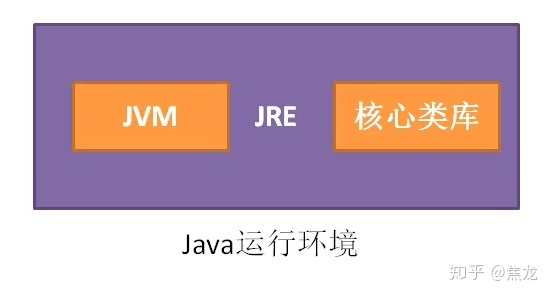
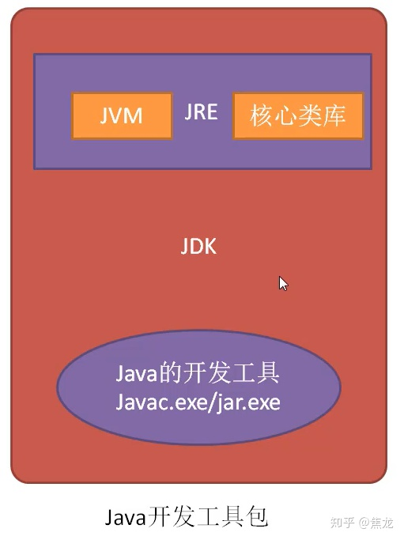

# temp_train

##  JRE、JDK、JVM 之间的区别与联系

* JVM ：英文名称（Java Virtual Machine），就是我们耳熟能详的 Java 虚拟机。它只认识 xxx.class 这种类型的文件，它能够将 class 文件中的字节码指令进行识别并调用操作系统向上的 API 完成动作。所以说，jvm 是 Java 能够跨平台的核心，具体的下文会详细说明。

* JRE ：英文名称（Java Runtime Environment），我们叫它：Java 运行时环境。它主要包含两个部分，jvm 的标准实现和 Java 的一些基本类库。它相对于 jvm 来说，多出来的是一部分的 Java 类库。

* JDK ：英文名称（Java Development Kit），Java 开发工具包。jdk 是整个 Java 开发的核心，它集成了 jre 和一些好用的小工具。例如：javac.exe，java.exe，jar.exe 等。

显然，这三者的关系是：一层层的嵌套关系：JDK>JRE>JVM

* JVM + 核心类库 = JRE

* JRE + java开发工具（javac.exe/jar.exe) = JDK
> 从jdk11开始，jdk和jre统一化。